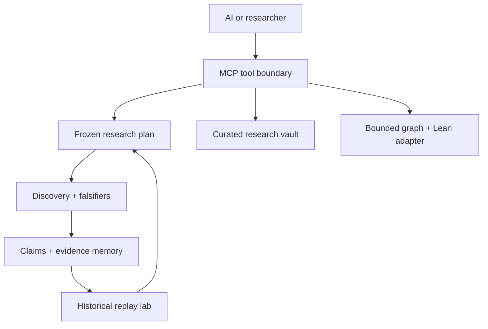

# Orbita Agent Research Server v0.5.0

Orbita Agent Research Server is a local, MCP-native research system for people and AI agents. It turns supplied data into an explicit analysis plan, freezes that plan before confirmation scoring, runs bounded falsification checks, and stores both survivors and failures in persistent epistemic memory.

It also exposes a curated read-only research vault, preserved Erdős–Gyárfás search receipts, bounded finite-graph
analysis, Lean source export for concrete certificates, and a governed self-improvement lab for its declarative
research policy.

The product rule is simple:

> The model may propose. Replay, exact hashes, falsifiers, evidence ledgers, and human approval decide what may run,
> activate, and be claimed.

## What was combined

The build uses the strongest compatible parts of the supplied archives:

| Source | Role in this product |
| --- | --- |
| Orbita Research MVP v0.1 | Governed intake, profiling, frozen plans, discovery runs, belief memory, and reports |
| Orbita Epistemic Runtime v1.5 | Claims, evidence, checks, contradictions, supersession, dependency collapse, and hash-bound receipts |
| Orbita Discovery Kit v0.2 | Propose → judge → falsify → ledger engine and safe tabular candidates |
| Math Discovery Research Vault | Curated documents and structured claim-status cards |
| Erdős–Gyárfás research database | Finite run summaries, exact labeled near misses, caveats, and certificates |
| Lemma Miner + Lean checker | Bounded graph profiling and finite certificate export |

Raw conversations, duplicate build trees, stale binaries, unrestricted execution routes, and desktop-control capabilities are not exposed to agents.

## Architecture



## Discovery Genome bridge

The existing MCP endpoint remains the single ChatGPT entry point. It calls a narrow, bearer-authenticated service API
on `orbita-guided-ui`; PostgreSQL credentials and tenant UUID selection are never exposed to the MCP client.

Configure the Guided UI service:

| Variable | Value |
| --- | --- |
| `ORBITA_GENOME_SERVICE_TOKEN` | A shared random secret of at least 32 characters |
| `ORBITA_GENOME_SERVICE_ALLOWED_USERS` | Comma-separated Guided UI usernames allowed through the bridge |

Configure this MCP service with the matching identity:

| Variable | Value |
| --- | --- |
| `ORBITA_DISCOVERY_GENOME_URL` | Guided UI origin, without a trailing API path |
| `ORBITA_DISCOVERY_GENOME_SERVICE_TOKEN` | The same shared secret |
| `ORBITA_DISCOVERY_GENOME_TIMEOUT` | Optional request timeout in seconds; default 20 |
| `ORBITA_DISCOVERY_GENOME_USERNAME` | Single-principal fallback; applies only when exactly one GitHub user is allowed |
| `ORBITA_GENOME_TENANT_BINDINGS` | Optional JSON object mapping authenticated subject to Guided UI username |
| `ORBITA_GENOME_ALLOW_SHARED_TENANTS` | Optional; permit several subjects on one tenant. Default off |

The bridge exposes operator creation, evidence, blind tournaments, and one-time result recording. Operator and
tournament freezes require server-generated review hashes plus exact confirmation phrases, and the Guided UI checks
those hashes inside the same database transaction that freezes the reviewed object. Result receipts bind the target
tournament ID, entry ID, verdict, and result payload.

### Tenant isolation

Every Discovery Genome request is scoped to the tenant bound to the **authenticated caller**, resolved per request
from the OAuth subject. There is no deployment-wide tenant and no default: an authenticated identity with no binding
is refused rather than served someone else's Genome. The bridge cannot activate a research-policy improvement or
select an arbitrary tenant.

The GitHub allowlist and the tenant registry are two separate gates. Passing `ORBITA_OAUTH_ALLOWED_GITHUB_USERS` only
permits sign-in; it never implies access to a tenant.

Bindings are operator-only and require filesystem access to the deployment state. They are deliberately **not**
exposed as MCP tools, so no caller can grant itself a tenant:

```bash
orbita-agent tenants identities
```

```bash
orbita-agent tenants bind --login SomeUser --username their-guided-ui-username
```

`tenants list` shows current bindings, `tenants events` prints the append-only audit trail, and `tenants unbind`
revokes access. Binding by `--login` requires that the user has completed GitHub sign-in once, so their subject is
known; otherwise pass `--subject github:<id>` explicitly. Two subjects cannot be bound to one tenant unless you pass
`--allow-shared`, and rebinding a subject requires `--overwrite`.

Existing single-owner deployments keep working with no variable changes. When exactly one GitHub user is allowed and
`ORBITA_DISCOVERY_GENOME_USERNAME` is set, that user is auto-bound to that tenant on first sign-in. This fallback
disengages as soon as a second GitHub user is allowed, at which point explicit bindings become mandatory and the
server refuses to start without them.

## Install

Python 3.11 or newer is required.

Windows PowerShell:

```powershell
py -3.11 -m venv .venv
.\.venv\Scripts\Activate.ps1
python -m pip install --upgrade pip
python -m pip install .
orbita-agent doctor
orbita-agent demo
```

macOS or Linux:

```bash
python3 -m venv .venv
source .venv/bin/activate
python -m pip install --upgrade pip
python -m pip install .
orbita-agent doctor
orbita-agent demo
```

`install.ps1` performs the Windows setup automatically.

## Connect an AI through MCP

For a local stdio connection, configure an MCP host with the installed executable:

```json
{
  "mcpServers": {
    "orbita": {
      "command": "C:\\FULL\\PATH\\TO\\.venv\\Scripts\\orbita-agent.exe",
      "args": ["serve", "--transport", "stdio"],
      "env": {
        "ORBITA_AGENT_HOME": "C:\\Users\\YOUR_NAME\\OrbitaAgentData"
      }
    }
  }
}
```

For local Streamable HTTP:

```powershell
orbita-agent serve --transport streamable-http --host 127.0.0.1 --port 8765
```

The MCP endpoint is `http://127.0.0.1:8765/mcp`.

Local operation remains unauthenticated when bound to `127.0.0.1`. The production image uses OAuth 2.1 with GitHub
identity by default. ChatGPT dynamically registers a client, uses authorization code + PKCE, and is redirected to
GitHub for operator sign-in. Orbita admits only usernames in `ORBITA_OAUTH_ALLOWED_GITHUB_USERS` and issues its own
short-lived, revocable bearer tokens. Static bearer mode remains available for rollback and non-interactive clients.

## Deploy on Railway

The repository includes a non-root Docker image, Railway config-as-code, an unauthenticated `/health` readiness
route, OAuth discovery/registration/token/revocation routes, and protected `/mcp`. Follow
[the Railway deployment guide](docs/RAILWAY_DEPLOYMENT.md).

## Recommended agent flow

1. Call `orbita_capabilities`.
2. Create a case with `orbita_create_case`.
3. Attach CSV/TSV/JSON(L)/text with `orbita_add_inline_file`.
4. Inspect `orbita_case_context`.
5. Compile a deterministic plan or submit an explicit AI-authored plan.
6. Fetch the complete plan and its hash with `orbita_get_plan`.
7. Ask the user to review it. Approval is a separate tool call bound to the exact hash.
8. Run the approved plan with `orbita_run_discovery`.
9. Read every survivor and refutation, then inspect claim history and the report.
10. When evidence changes, record contradiction or supersession instead of erasing history.

## Governed self-improvement

### Governed semantic evolution

Orbita can now represent a finite executable language as an immutable `LanguageSnapshot`, partition explicit worlds
by what that language can observe, identify exact outcome-changing collisions and nuisance overseparation, and issue a
hash-bound `LanguageLimitCertificate`. A proposed repair must name one declarative primitive plus prospective recovery,
unchanged-control, and new-failure predictions. Only a prospectively survived, exact-hash evaluation plus the exact
human transition phrase can materialize the next snapshot.

Materialization deliberately creates an **inert** `L(t+1)` snapshot and transition receipt. It does not execute proposed
semantics, edit source code, deploy, or modify the active Orbita runtime. This keeps language diagnosis, candidate
generation, evaluation, authorization, and runtime activation as separate authorities.

The companion capability-component graph converts archived ideas into typed inputs, outputs, capabilities, needs,
failure modes, assumptions, and falsifiers. Its edges assert interface matches only—not scientific validity or successful
composition.

### General Problem Loop

Orbita can freeze an arbitrary objective into an append-only state machine covering representation, planning, executor
receipts, observation, falsification, diagnosis, inactive repair/learning proposals, bounded retries, and evidence-bound
commit or refusal. The attached model supplies proposals; Orbita validates each stage and controls every transition.
See [docs/GENERAL_PROBLEM_LOOP.md](docs/GENERAL_PROBLEM_LOOP.md).

Orbita can learn from completed cases without rewriting its own code. The improvement lab can change only a small
allowlist of research-policy values: candidate budget, scout split, deterministic seed, judge thresholds, and
cross-seed falsification settings.

1. `orbita_suggest_improvement` summarizes completed runs and creates one conservative proposal, or an AI can call
   `orbita_propose_improvement` with an explicit patch and acceptance criteria.
2. `orbita_evaluate_improvement` deterministically replays the active and proposed policies against frozen case,
   plan, and dataset-hash receipts.
3. A passing replay is only `eligible_for_review`; it is not automatically “better.”
4. `orbita_promote_improvement` requires the exact candidate hash, latest evaluation hash, reviewer identity, and
   exact confirmation phrase.
5. `orbita_rollback_improvement` can restore a previously active policy through another hash-bound approval.

The generalized governed registry is a separate, inactive lane. It can register policy, code, operator, verifier,
language, retrieval, UI, performance, and safety candidates; freeze their evaluation contracts; and record one
hash-bound result. It has no generalized promotion, merge, or deployment tool.

## Deterministic external experiments

Questions that do not fit Orbita's built-in table scorer can be preserved and routed through a frozen external
experiment instead of being silently translated into a different statistical question. The Agent/MCP v1 route:

1. requires an already approved Orbita plan and its exact hash;
2. freezes claim scope, coverage (including untested regions), inline code/data, outputs, verifier, and anti-rescue rules;
3. stages a digest-pinned, network-disabled, non-root execution manifest;
4. requires separate human approval bound to both experiment and manifest hashes;
5. records output and execution-receipt hashes; and
6. stores independent verification separately from execution integrity.

A successful run remains epistemically `UNVERIFIED` until a verifier receipt is recorded. Even then, support is
reported as `EMPIRICAL_SURVIVOR`, not universal proof. The v1 MCP surface accepts inline text artifacts only and
rejects arbitrary server file paths.

Successful executions can be replayed from their exact staged artifacts. The replay receives a new manifest and a
separate exact-hash human approval. Matching output hashes establish bitwise technical reproduction only; Orbita
explicitly reports that scientific reproduction is not established by same-protocol replay.

If a missed, independently receipt-backed counterexample exposes a coverage bug, Orbita preserves the original
experiment, changes its epistemic status to `REFUTED` or `CHALLENGED` as declared by the validated effect, creates a
hash-bound replacement protocol version, and marks reevaluation required. It never edits the old protocol in place.

The replacement protocol can then be frozen as a new deterministic execution. Every affected result must be declared
before approval. After execution, the bug remains open until every declared result receives exactly one disposition
(`refuted`, `challenged`, `unchanged`, or `superseded`) tied to the exact replacement execution receipt.

Guided discovery findings also carry a separate epistemic contract: an explicit evidence status, normalized claim
scope, falsification coverage, and known untested regions. `supported` translates to `EMPIRICAL_SURVIVOR`, never
`FORMALLY_PROVED`. The read-only `orbita_guard_claim_scope` MCP tool rejects attempts to turn sample or bounded
evidence into a broader universal claim. Epistemic events are append-only and appear in reconstructed claim history.
Validated external coverage bugs may name affected Guided claim IDs. Orbita then preserves immutable claim bindings,
appends a downgraded evidence state, and opens re-examination work for those claims and their dependents. The
`orbita_propagate_external_coverage_bug_to_claims` tool safely retries this cross-database projection without creating
duplicate history.

## Prospective blind calibration

Plans containing exactly one `prospective_blind_calibration` candidate use a separate prediction-before-reveal
workflow instead of the ordinary association scorer. The plan freezes the sanitized blind input, visible fields,
allowed hypotheses, epistemic labels, evidence classes, forbidden outputs, prediction-provider policy, and scoring
schema. The prediction provider can be an LLM, another model, a deterministic ruleset, or a human process, but its
identity is stored in the immutable prediction receipt.

The workflow enforces this order:

1. prepare the protocol from an exact approved plan and a sanitized row-level input;
2. expose only the visible rows and frozen output vocabulary;
3. validate and freeze exactly one prediction per row with a SHA-256 receipt;
4. accept a separate scoring key only after prediction freeze;
5. require exact protocol, prediction, and scoring-key hashes plus explicit reveal approval; and
6. score the immutable predictions, preserving row-level accuracy, hypothesis hits, and calibration error.

Declared scoring-key or unresolved-holdout fields are rejected if they occur in the blind input. Scoring-key contents
live in a separate tenant-scoped database and are never returned by the prediction batch or ordinary status tools.
This protocol is domain-neutral: UAP event calibration, medical cases, materials failure, hardware faults, biology,
and AI-safety labels use the same governed machinery. See
[`docs/PROSPECTIVE_BLIND_CALIBRATION.md`](docs/PROSPECTIVE_BLIND_CALIBRATION.md).

The lab cannot edit source, invoke a shell, deploy, or activate its own proposal. New plans record the active policy
ID, version, hash, and whether the caller overrode the candidate budget.

The exact approval phrase is reported by `orbita_capabilities`; clients should not guess it.

## Tool groups

- Research: cases, inline files, context, plans, approval, discovery, paginated runs, and reports.
- Memory: case claims, claim history, dependency impact, contradictions, supersession, and re-examination.
- Vault: full-text curated research search and structured claim cards.
- Graph theory: preserved finite-run summaries, near misses, bounded graph analysis, and Lean witness export.
- Improvement: history-derived proposals, deterministic benchmark replay, policy activation, and rollback.
- External experiments: scope-preserving deterministic execution with exact approval and independent verification.
- Blind calibration: sanitized prediction batches, immutable prediction freezes, sealed gold keys, and approved reveal.

## Scientific boundaries

- A held-out score is not a probability that a claim is true.
- Association is not causation.
- Survival against configured attacks is not universal proof or novelty.
- Open discovery is scout/confirmation separated, but it still requires external replication.
- “No witness found” under a bounded graph search can be inconclusive.
- Lean export certifies one explicit finite graph/cycle only.
- Replay eligibility measures configured stability criteria; it does not establish scientific superiority.

See [AI operator guide](docs/AI_OPERATOR_GUIDE.md), [architecture](docs/ARCHITECTURE.md), [security](docs/SECURITY.md), [source provenance](docs/SOURCE_PROVENANCE.md), and [validation](VALIDATION.md).
