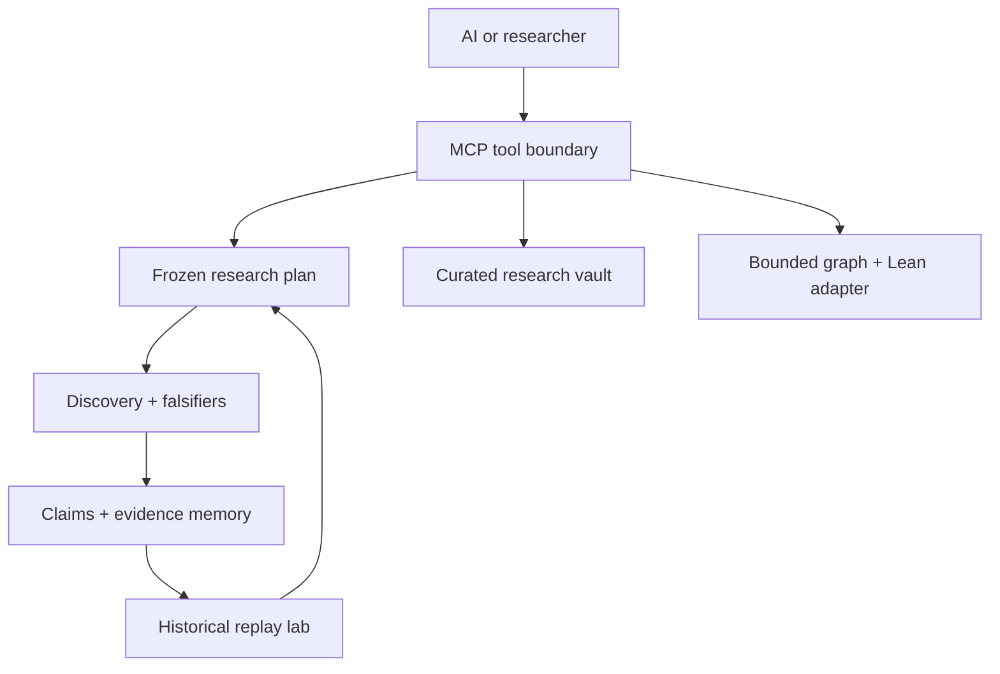

# Orbita Agent Research Server v0.4.0

Orbita Agent Research Server is a local, MCP-native research system for people and AI agents. It turns supplied data into an explicit analysis plan, freezes that plan before confirmation scoring, runs bounded falsification checks, and stores both survivors and failures in persistent epistemic memory.

It also exposes a curated read-only research vault, preserved Erdős–Gyárfás search receipts, bounded finite-graph
analysis, Lean source export for concrete certificates, and a governed self-improvement lab for its declarative
research policy.

The product rule is simple:

> The model may propose. Replay, exact hashes, falsifiers, evidence ledgers, and human approval decide what may run,
> activate, and be claimed.

## What was combined

The build uses the strongest compatible parts of the supplied archives:

| Source | Role in this product |
| --- | --- |
| Orbita Research MVP v0.1 | Governed intake, profiling, frozen plans, discovery runs, belief memory, and reports |
| Orbita Epistemic Runtime v1.5 | Claims, evidence, checks, contradictions, supersession, dependency collapse, and hash-bound receipts |
| Orbita Discovery Kit v0.2 | Propose → judge → falsify → ledger engine and safe tabular candidates |
| Math Discovery Research Vault | Curated documents and structured claim-status cards |
| Erdős–Gyárfás research database | Finite run summaries, exact labeled near misses, caveats, and certificates |
| Lemma Miner + Lean checker | Bounded graph profiling and finite certificate export |

Raw conversations, duplicate build trees, stale binaries, unrestricted execution routes, and desktop-control capabilities are not exposed to agents.

## Architecture



## Discovery Genome bridge

The existing MCP endpoint remains the single ChatGPT entry point. It calls a narrow, bearer-authenticated service API
on `orbita-guided-ui`; PostgreSQL credentials and tenant UUID selection are never exposed to the MCP client.

Configure the Guided UI service:

| Variable | Value |
| --- | --- |
| `ORBITA_GENOME_SERVICE_TOKEN` | A shared random secret of at least 32 characters |
| `ORBITA_GENOME_SERVICE_ALLOWED_USERS` | Comma-separated Guided UI usernames allowed through the bridge |

Configure this MCP service with the matching identity:

| Variable | Value |
| --- | --- |
| `ORBITA_DISCOVERY_GENOME_URL` | Guided UI origin, without a trailing API path |
| `ORBITA_DISCOVERY_GENOME_SERVICE_TOKEN` | The same shared secret |
| `ORBITA_DISCOVERY_GENOME_USERNAME` | One username from the Guided UI allowlist |
| `ORBITA_DISCOVERY_GENOME_TIMEOUT` | Optional request timeout in seconds; default 20 |

The bridge exposes operator creation, evidence, blind tournaments, and one-time result recording. Operator and
tournament freezes require server-generated review hashes plus exact confirmation phrases. It cannot activate a
research-policy improvement or select an arbitrary tenant.

## Install

Python 3.11 or newer is required.

Windows PowerShell:

```powershell
py -3.11 -m venv .venv
.\.venv\Scripts\Activate.ps1
python -m pip install --upgrade pip
python -m pip install .
orbita-agent doctor
orbita-agent demo
```

macOS or Linux:

```bash
python3 -m venv .venv
source .venv/bin/activate
python -m pip install --upgrade pip
python -m pip install .
orbita-agent doctor
orbita-agent demo
```

`install.ps1` performs the Windows setup automatically.

## Connect an AI through MCP

For a local stdio connection, configure an MCP host with the installed executable:

```json
{
  "mcpServers": {
    "orbita": {
      "command": "C:\\FULL\\PATH\\TO\\.venv\\Scripts\\orbita-agent.exe",
      "args": ["serve", "--transport", "stdio"],
      "env": {
        "ORBITA_AGENT_HOME": "C:\\Users\\YOUR_NAME\\OrbitaAgentData"
      }
    }
  }
}
```

For local Streamable HTTP:

```powershell
orbita-agent serve --transport streamable-http --host 127.0.0.1 --port 8765
```

The MCP endpoint is `http://127.0.0.1:8765/mcp`.

Local operation remains unauthenticated when bound to `127.0.0.1`. The production image uses OAuth 2.1 with GitHub
identity by default. ChatGPT dynamically registers a client, uses authorization code + PKCE, and is redirected to
GitHub for operator sign-in. Orbita admits only usernames in `ORBITA_OAUTH_ALLOWED_GITHUB_USERS` and issues its own
short-lived, revocable bearer tokens. Static bearer mode remains available for rollback and non-interactive clients.

## Deploy on Railway

The repository includes a non-root Docker image, Railway config-as-code, an unauthenticated `/health` readiness
route, OAuth discovery/registration/token/revocation routes, and protected `/mcp`. Follow
[the Railway deployment guide](docs/RAILWAY_DEPLOYMENT.md).

## Recommended agent flow

1. Call `orbita_capabilities`.
2. Create a case with `orbita_create_case`.
3. Attach CSV/TSV/JSON(L)/text with `orbita_add_inline_file`.
4. Inspect `orbita_case_context`.
5. Compile a deterministic plan or submit an explicit AI-authored plan.
6. Fetch the complete plan and its hash with `orbita_get_plan`.
7. Ask the user to review it. Approval is a separate tool call bound to the exact hash.
8. Run the approved plan with `orbita_run_discovery`.
9. Read every survivor and refutation, then inspect claim history and the report.
10. When evidence changes, record contradiction or supersession instead of erasing history.

## Governed self-improvement

Orbita can learn from completed cases without rewriting its own code. The improvement lab can change only a small
allowlist of research-policy values: candidate budget, scout split, deterministic seed, judge thresholds, and
cross-seed falsification settings.

1. `orbita_suggest_improvement` summarizes completed runs and creates one conservative proposal, or an AI can call
   `orbita_propose_improvement` with an explicit patch and acceptance criteria.
2. `orbita_evaluate_improvement` deterministically replays the active and proposed policies against frozen case,
   plan, and dataset-hash receipts.
3. A passing replay is only `eligible_for_review`; it is not automatically “better.”
4. `orbita_promote_improvement` requires the exact candidate hash, latest evaluation hash, reviewer identity, and
   exact confirmation phrase.
5. `orbita_rollback_improvement` can restore a previously active policy through another hash-bound approval.

The lab cannot edit source, invoke a shell, deploy, or activate its own proposal. New plans record the active policy
ID, version, hash, and whether the caller overrode the candidate budget.

The exact approval phrase is reported by `orbita_capabilities`; clients should not guess it.

## Tool groups

- Research: cases, inline files, context, plans, approval, discovery, paginated runs, and reports.
- Memory: case claims, claim history, dependency impact, contradictions, supersession, and re-examination.
- Vault: full-text curated research search and structured claim cards.
- Graph theory: preserved finite-run summaries, near misses, bounded graph analysis, and Lean witness export.
- Improvement: history-derived proposals, deterministic benchmark replay, policy activation, and rollback.

## Scientific boundaries

- A held-out score is not a probability that a claim is true.
- Association is not causation.
- Survival against configured attacks is not universal proof or novelty.
- Open discovery is scout/confirmation separated, but it still requires external replication.
- “No witness found” under a bounded graph search can be inconclusive.
- Lean export certifies one explicit finite graph/cycle only.
- Replay eligibility measures configured stability criteria; it does not establish scientific superiority.

See [AI operator guide](docs/AI_OPERATOR_GUIDE.md), [architecture](docs/ARCHITECTURE.md), [security](docs/SECURITY.md), [source provenance](docs/SOURCE_PROVENANCE.md), and [validation](VALIDATION.md).
