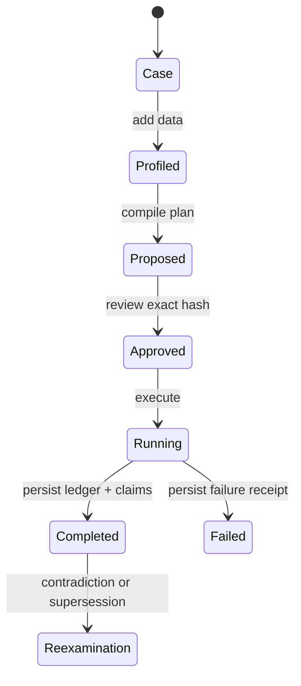

# Architecture

## Product boundary

The agent server deliberately wraps only the research-facing subset of the supplied runtime.

| Layer | Responsibility | Agent authority |
| --- | --- | --- |
| MCP server | Typed tools, resources, annotations, payload limits | Calls narrow registered functions only |
| Agent gateway | Validation, locking, plan-hash approval, public result shaping | No arbitrary filesystem path or shell input |
| Research MVP | Cases, ingestion, compiler, approved runs, dossiers | Plan must already be approved |
| Discovery engine | Candidate scoring, judging, falsifiers, append-only ledger | Runs frozen candidate payloads |
| Epistemic memory | Claims, evidence, checks, contradictions, derivations, supersession | History is appended, not rewritten |
| Knowledge store | Curated documents, claim cards, finite graph receipts | Read-only SQLite connection |
| Graph adapter | Bounded exact cycle search and Lean source rendering | Vertex, edge, time, and state limits |

## State lifecycle

## Why MCP

MCP separates the AI model from the research system. The model receives typed tools and resources; Orbita keeps persistence, validation, plan state, and falsification logic. The dependency is pinned to the stable MCP Python SDK v1 line (`mcp>=1.28,<2`) because the v2 line was still pre-release at build time.

## Concurrency

The gateway serializes access to the local SQLite-backed research service with a re-entrant lock. This is intentional for a single-user local server. Horizontal scaling and multi-tenant isolation are out of scope for v0.1.

## Knowledge curation

The bundled knowledge database contains curated research documents, structured claim cards, and selected database tables. Raw conversations and recovered attachment dumps are excluded. Search results preserve the source archive name and original relative path.
